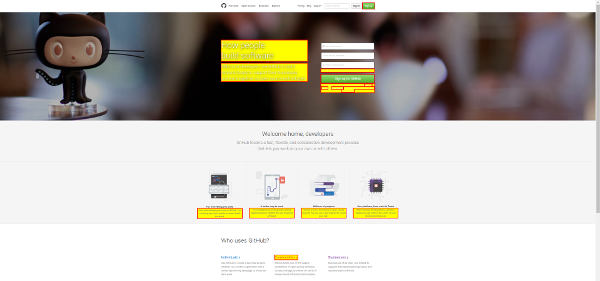

# a11y-ci

Tests continus d'accessibilité, avec rapports HTML et JUnit.

## Installation

    npm install -g a11y-ci

## Utilisation

    a11y-ci [--junit=junit.xml] [--html=report.html]  <url>
    
    # Exemple:
    a11y-ci --html=report.html https://www.github.com 

Options:

+ `--html=myfile.html`: génère un rapport HTML visuel des erreurs sur votre page
+ `--junit=myfile.xml`: génère un rapport dans un format JUnit
+ `--htmldox=myfile.html`: Liste toutes les erreurs dans un rapport HTML
+ `--violations=myfile.xml`: Génère un rapport au format Pmd-Violations

## Comment ça marche

a11y-ci explore votre site internet à l'aide de [PhantomJs](https://github.com/ariya/phantomjs) et examine sa conformité avec des règles
 d'accessibilité avec 
[Accessibility Developer Tools](https://github.com/GoogleChrome/accessibility-developer-tools). 

N'hésitez pas à consulter les [règles de conformité](https://github.com/GoogleChrome/accessibility-developer-tools/wiki/Audit-Rules)

## Licence

Copyright Radio France, Licence [CeCILL-B](http://www.cecill.info/licences/Licence_CeCILL-B_V1-en.html) (fully compatible with BSD-like licenses (BSD, X11, MIT)).

Consultez le fichier [LICENSE-fr](LICENSE) pour plus de détails

## English version

Please read this [readme](README.md)